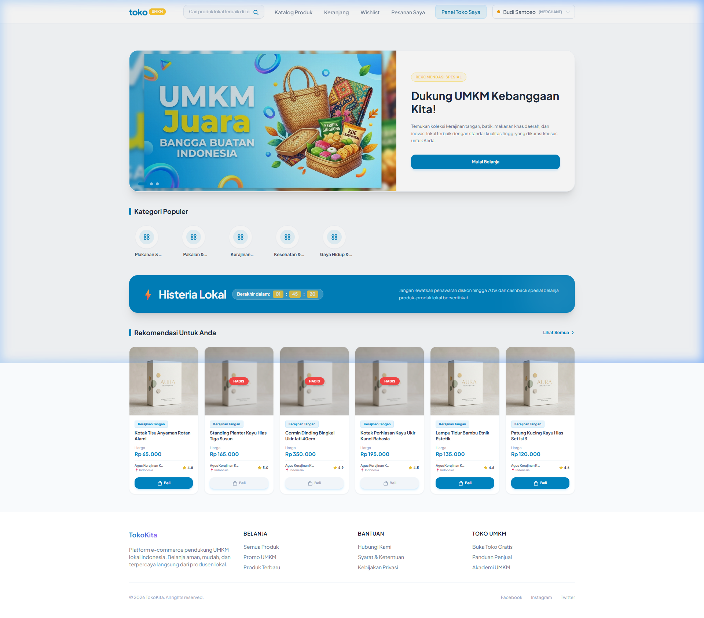
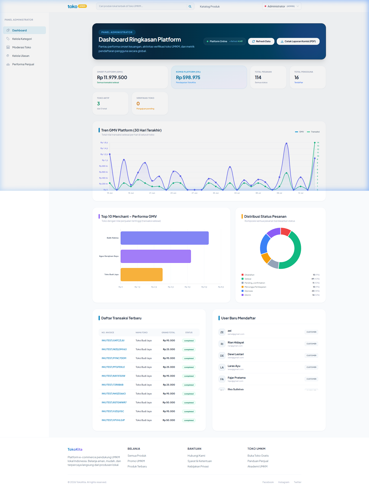
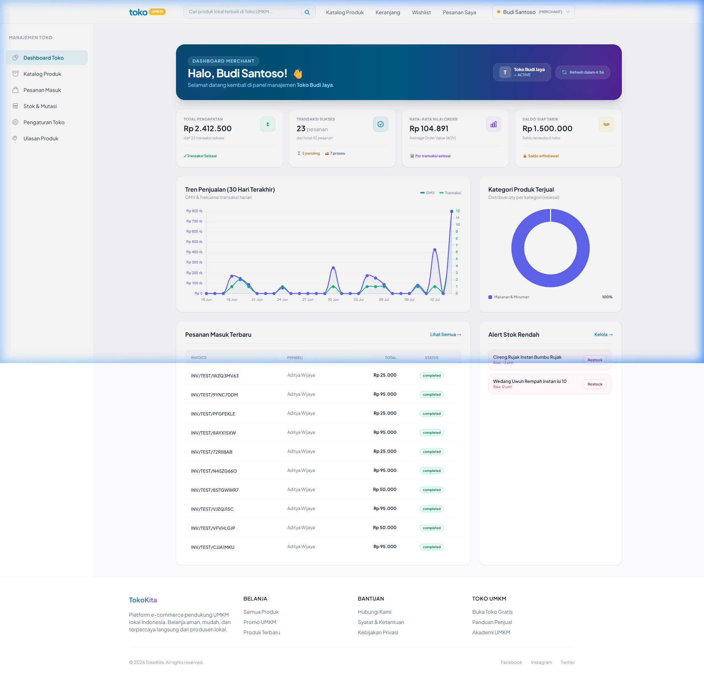
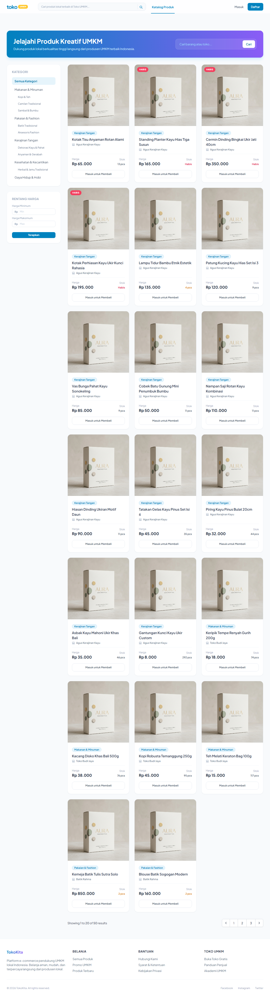

<](https://laravel.com)
[](https://php.net)
[](https://mysql.com)
[](https://tailwindcss.com)
[](https://playwright.dev)
[](LICENSE)

</div>

---

## 📋 Deskripsi Singkat

**TokoKita** adalah platform e-commerce multi-merchant yang dirancang khusus untuk mendigitalisasi pelaku **Usaha Mikro, Kecil, dan Menengah (UMKM)** di Indonesia. Platform ini memungkinkan pemilik UMKM (merchant) membuka toko online secara instan, mengelola katalog produk dan inventaris (stok), serta memantau analitik keuangan bisnis secara real-time.

Dibangun sebagai proyek Tugas Akhir/Skripsi, aplikasi ini mengimplementasikan arsitektur **MVC (Model-View-Controller)** menggunakan **Laravel 10** dengan fitur-fitur tingkat lanjut seperti *split-order checkout*, *stock ledger/audit trail*, *database locking* untuk pencegahan *race condition*, dan **10 jenis laporan** dalam format Dashboard, Grafik, PDF, dan Excel.

---

## 🖼️ Tangkapan Layar Fitur Utama

### Halaman Utama (Landing Page)
Halaman depan TokoKita menampilkan hero banner promosi UMKM, kategori populer, countdown flash sale, serta rekomendasi produk lokal secara dinamis dengan harga, rating, dan badge ketersediaan stok.



### Dashboard Administrator Platform
Dashboard khusus Admin yang menyajikan KPI Cards (Omzet GMV, Komisi Platform 5%, Total Pesanan, Total Pengguna), grafik tren GMV 30 hari, Top 10 Merchant berdasarkan performa, distribusi status pesanan (Pie Chart), daftar transaksi terbaru, dan daftar user baru mendaftar.



### Dashboard Merchant (Penjual)
Dashboard intuitif bagi pemilik toko UMKM menampilkan Total Pendapatan, Transaksi Sukses, Rata-rata Nilai Pesanan (AOV), Saldo Siap Tarik, grafik tren penjualan 30 hari (GMV & frekuensi), Donut Chart kategori produk terjual, daftar pesanan masuk terbaru, dan alert stok rendah (*low-stock warning*).



### Katalog Produk Publik
Halaman katalog produk yang dapat diakses publik dengan fitur pencarian, filter kategori hierarkis (sidebar), filter rentang harga, paginasi, serta tampilan kartu produk dengan gambar, harga, rating, dan nama toko.



---

## 🚀 Fitur Utama

### 1. Autentikasi & Manajemen Pengguna (Multi-Role)
- Registrasi dan login aman menggunakan enkripsi **Bcrypt** (Laravel Breeze).
- Tiga peran pengguna: **Admin Platform**, **Merchant (Penjual)**, dan **Customer (Pembeli)**.
- Manajemen alamat pengiriman dinamis (banyak alamat per user, satu alamat default).
- CRUD profil pengguna lengkap.

### 2. Manajemen Toko (Merchant)
- Pendaftaran toko mandiri oleh pembeli terdaftar (upgrade role ke merchant).
- Pengaturan profil toko: nama, slug URL unik, deskripsi, logo, banner, alamat asal toko.
- Status toko (buka/tutup) dan moderasi status oleh Admin (`pending` → `active` / `rejected` / `suspended`).

### 3. Katalog Produk & Manajemen Stok (Stock Ledger)
- Struktur kategori hirarkis (parent-child) dengan relasi pivot *Many-to-Many*.
- CRUD Produk lengkap dengan multi-upload gambar, berat (gram), deskripsi, harga.
- **Audit Trail Stok**: Log kronologis setiap perubahan stok via tabel `stock_mutations` (tipe `IN`, `OUT`, `ADJUSTMENT`).
- Alert produk stok rendah (*low-stock warning*) di dashboard merchant.

### 4. Transaksi & Alur Pesanan (Order Lifecycle)
- Keranjang belanja berbasis database (*database-backed shopping cart*).
- **Split Order Otomatis**: Checkout dari beberapa toko berbeda dipecah menjadi invoice terpisah per toko.
- Simulasi ongkos kirim berdasarkan berat produk dan alamat pengirim-penerima.
- **Pencegahan Race Condition**: `SELECT FOR UPDATE` dalam `DB::transaction` untuk pengurangan stok aman.
- State Machine status pesanan: `Pending Payment` → `Verifying` → `Processing` → `Shipped` → `Completed` / `Cancelled`.

### 5. Pembayaran & Ulasan
- Opsi pembayaran: Transfer Bank Manual, QRIS, dan E-Wallet dengan instruksi dinamis (Alpine.js).
- Upload bukti pembayaran oleh pembeli, konfirmasi oleh merchant/admin.
- Ulasan dan rating (skala 1-5) per item pesanan dengan penghitungan ulang rata-rata rating produk.

### 6. Wishlist
- Simpan produk favorit ke daftar keinginan untuk dibeli nanti.

### 7. Dashboard Analitis & 10 Jenis Laporan
Sistem menghasilkan **10 jenis laporan** dalam berbagai format:

| No | Nama Laporan | Format | Pengguna |
|:--:|:---|:---:|:---:|
| 1 | Dashboard Ringkasan Finansial Toko | Dashboard KPI | Merchant |
| 2 | Grafik Tren Penjualan Harian/Bulanan | Line/Bar Chart | Merchant |
| 3 | Distribusi Kategori Produk Terjual | Pie/Donut Chart | Merchant |
| 4 | Invoice Transaksi Pembelian | PDF | Pembeli & Merchant |
| 5 | Rekap Penjualan Berkala | PDF | Merchant |
| 6 | Produk Stok Kritis | PDF | Merchant |
| 7 | Rekap Penjualan untuk Akuntansi | Excel (XLSX) | Merchant |
| 8 | Kartu Mutasi Stok & Audit Trail | Excel (XLSX) | Merchant |
| 9 | Ulasan & Kepuasan Pelanggan | Excel (XLSX) | Merchant |
| 10 | Performa Merchant & Komisi Platform | Dashboard & PDF | Admin |

### 8. Optimasi Performa Database
- Tabel ringkasan `daily_sales_summaries` untuk menghindari kueri berat pada grafik dashboard.
- Indeks komposit pada tabel `orders`, `products`, `stock_mutations` untuk mempercepat laporan.
- Komisi platform 5% dihitung otomatis dari pesanan sukses.

---

## 🛠️ Tumpukan Teknologi (Tech Stack)

| Lapisan | Teknologi | Versi |
|:---|:---|:---|
| **Framework Backend** | Laravel | 10.x |
| **Bahasa Server** | PHP | 8.1+ |
| **Basis Data** | MySQL / MariaDB | 8.0+ / 10.x+ |
| **Frontend UI** | Blade Templates, Tailwind CSS, Alpine.js | — |
| **Scaffolding Auth** | Laravel Breeze | 1.29 |
| **Asset Bundler** | Vite | 4.x |
| **Generator PDF** | Barryvdh Laravel DomPDF | 3.1 |
| **Eksportir Spreadsheet** | Maatwebsite Excel | 3.1.48 |
| **E2E Testing** | Playwright | 1.61+ |
| **TypeScript Loader** | tsx | 4.x |

---

## 📂 Struktur Direktori Proyek

```text
toko-umkm-app/
├── .agent/                        # Konfigurasi agen AI (Rules, Skills, Workflows)
│   ├── rules/                     # Aturan dan panduan pengembangan
│   ├── skills/                    # Panduan skill: migration, model, setup, e2e-testing
│   └── workflows/                 # Workflow otomasi: generate-crud, db-reset, db-seed
├── app/
│   ├── Http/Controllers/          # 22 Resource Controllers (Admin, Merchant, Customer)
│   ├── Models/                    # 13 Eloquent Models dengan relasi lengkap
│   ├── Services/                  # Service Layer (business logic terpisah)
│   └── Exports/                   # Kelas ekspor Maatwebsite Excel
├── database/
│   ├── migrations/                # 17 berkas migrasi skema database
│   ├── seeders/                   # 7 berkas seeder data realistis
│   └── factories/                 # Model Factory untuk testing
├── docs/                          # DOKUMENTASI SISTEM LENGKAP
│   ├── screenshots/               # Tangkapan layar fitur utama (4 gambar)
│   ├── 01-deskripsi-sistem.md     # Analisis Kebutuhan Sistem & Deskripsi Aktor
│   ├── 02-scope-aplikasi.md       # Batasan Lingkup & Matriks Laporan
│   ├── database/
│   │   ├── README.md              # Penjelasan Relasi Database & Konvensi
│   │   ├── erd.dbml               # Database Markup Language (ERD)
│   │   └── laporan-query.md       # Analisis Kueri & Optimasi Indeks Komposit
│   ├── testing/                   # Artefak keluaran testing (PDF, Excel)
│   └── uml/                       # 53 Diagram PlantUML (Use Case, Class, Activity, Sequence)
├── resources/views/               # Blade Template Views
├── routes/
│   ├── web.php                    # Definisi routing web (public, auth, merchant, admin)
│   └── auth.php                   # Routing autentikasi (Breeze)
├── tests/
│   ├── e2e/                       # Playwright E2E Test Suites
│   │   ├── specs/                 # 12 file spesifikasi test
│   │   ├── fixtures/              # Custom test fixtures per role
│   │   ├── helpers/               # Helper seeders dan utilities
│   │   └── pages/                 # Page Object Model (POM)
│   ├── Feature/                   # PHPUnit Feature Tests
│   └── Unit/                      # PHPUnit Unit Tests
├── playwright.config.ts           # Konfigurasi Playwright (Chromium, base URL, trace, video)
├── composer.json                  # Dependensi PHP/Laravel
├── package.json                   # Dependensi Node.js/Frontend
├── vite.config.js                 # Konfigurasi Vite Asset Bundling
├── tailwind.config.js             # Konfigurasi Tailwind CSS
├── .env.example                   # Template environment variable (tanpa kredensial)
├── .gitignore                     # Daftar file/folder yang diabaikan Git
└── LICENSE                        # Lisensi MIT
```

---

## ⚙️ Langkah Instalasi & Konfigurasi

Ikuti langkah-langkah berikut untuk menyiapkan proyek di lingkungan lokal Anda.

### Prasyarat (Prerequisites)
- **PHP** ≥ 8.1 dengan ekstensi: `mbstring`, `xml`, `curl`, `mysql`, `zip`, `gd`
- **Composer** ≥ 2.x
- **Node.js** ≥ 18.x dan **npm** ≥ 9.x
- **MySQL** ≥ 8.0 atau **MariaDB** ≥ 10.x
- **Git** ≥ 2.x

### 1. Kloning Repositori
```bash
git clone https://github.com/znlilmi/toko-umkm-app.git
cd toko-umkm-app
```

### 2. Pasang Dependensi Backend (Composer)
```bash
composer install
```

### 3. Pasang Dependensi Frontend (NPM)
```bash
npm install
```

### 4. Salin & Konfigurasi File Environment
```bash
cp .env.example .env
```
Buka file `.env` dan sesuaikan konfigurasi database Anda:
```env
DB_CONNECTION=mysql
DB_HOST=127.0.0.1
DB_PORT=3306
DB_DATABASE=tokokita       # Pastikan database ini sudah dibuat di MySQL
DB_USERNAME=root            # Username MySQL Anda
DB_PASSWORD=                # Password MySQL Anda (kosongkan jika tidak ada)
```

### 5. Generate Application Key
```bash
php artisan key:generate
```

### 6. Buat Symbolic Link untuk Storage
```bash
php artisan storage:link
```

### 7. Jalankan Migrasi & Seeder Database
```bash
php artisan migrate:fresh --seed
```
Perintah ini akan membuat seluruh tabel dan mengisi data dummy realistis (14+ users, 3 shops, 50+ products, 100+ orders, reviews, dsb).

### 8. Jalankan Agregasi Laporan Ringkasan Harian
Tabel `daily_sales_summaries` diisi secara terpisah untuk mensimulasikan pekerjaan agregasi terjadwal:
```bash
php artisan tinker --execute="
\$completedOrders = DB::table('orders')->where('status', 'completed')->whereExists(function (\$query) { \$query->select(DB::raw(1))->from('order_items')->whereColumn('order_items.order_id', 'orders.id'); })->get();
\$summaryGroups = [];
foreach (\$completedOrders as \$order) {
    \$date = date('Y-m-d', strtotime(\$order->created_at));
    \$key = \"{\$order->shop_id}_{\$date}\";
    if (!isset(\$summaryGroups[\$key])) {
        \$summaryGroups[\$key] = ['shop_id' => \$order->shop_id, 'date' => \$date, 'total_orders' => 0, 'total_revenue' => 0.00, 'total_commission' => 0.00];
    }
    \$summaryGroups[\$key]['total_orders'] += 1;
    \$summaryGroups[\$key]['total_revenue'] += \$order->grand_total;
    \$summaryGroups[\$key]['total_commission'] += \$order->grand_total * 0.05;
}
foreach (\$summaryGroups as \$group) {
    DB::table('daily_sales_summaries')->updateOrInsert(['shop_id' => \$group['shop_id'], 'date' => \$group['date']], array_merge(\$group, ['created_at' => now(), 'updated_at' => now()]));
}
echo 'Proses seeding laporan harian sukses!' . PHP_EOL;
"
```

### 9. Verifikasi Data Database
Pastikan seluruh data berhasil dibuat:
```bash
php artisan tinker --execute="foreach(['users', 'addresses', 'shops', 'categories', 'products', 'category_product', 'carts', 'orders', 'order_items', 'payments', 'reviews', 'stock_mutations', 'daily_sales_summaries', 'wishlists'] as \$table) { try { echo sprintf('%-25s : %d records' . PHP_EOL, \$table, DB::table(\$table)->count()); } catch (\Exception \$e) { echo sprintf('%-25s : ERROR' . PHP_EOL, \$table); } }"
```

**Hasil Verifikasi yang Diharapkan:**

| Tabel | Jumlah Records |
|:---|:---|
| `users` | ≥ 14 (1 admin, 3 merchants, 10 customers) |
| `addresses` | ≥ 23 |
| `shops` | ≥ 3 (1 per merchant) |
| `categories` | ≥ 12 (parent + sub-kategori) |
| `products` | ≥ 50 |
| `category_product` | ≥ 100 (relasi pivot M:N) |
| `orders` | ≥ 100 |
| `order_items` | ≥ 100 |
| `payments` | ≥ 90 |
| `reviews` | Ulasan acak dari pesanan selesai |
| `stock_mutations` | Log ledger pergerakan stok |
| `daily_sales_summaries` | Agregasi ringkasan harian |

### 10. Bangun Aset Frontend & Jalankan Server
```bash
# Terminal 1: Build aset (atau gunakan dev server untuk hot-reload)
npm run build
# Atau untuk pengembangan aktif:
npm run dev

# Terminal 2: Jalankan server Laravel
php artisan serve
```

Aplikasi sekarang dapat diakses di **[http://127.0.0.1:8000](http://127.0.0.1:8000)**.

### 🔑 Akun Login Default (Seeder)

| Role | Email | Password |
|:---|:---|:---|
| Admin | `admin@tokokita.test` | `password` |
| Merchant | *(lihat data seeder di `database/seeders/UserSeeder.php`)* | `password` |
| Customer | *(lihat data seeder di `database/seeders/UserSeeder.php`)* | `password` |

---

## 🧪 Cara Menjalankan E2E Testing (Playwright)

Proyek ini menggunakan **Playwright** untuk pengujian end-to-end yang menguji alur registrasi, checkout belanja, mutasi stok, unduh laporan PDF/Excel, CRUD produk, ulasan, dan filter pencarian produk.

### Prasyarat Testing
1. Pastikan server Laravel berjalan (`php artisan serve`).
2. Pastikan database sudah ter-seed dengan data lengkap.
3. Pastikan Vite dev server berjalan (`npm run dev`) atau aset sudah di-build (`npm run build`).
4. Install browser Playwright:
   ```bash
   npx playwright install chromium
   ```

### Menjalankan Seluruh Test
Karena proyek menggunakan ES Modules (`"type": "module"` di `package.json`), Anda harus menyertakan loader `tsx` melalui `NODE_OPTIONS`:

**Windows (PowerShell):**
```powershell
$env:NODE_OPTIONS="--experimental-loader tsx"; npx playwright test
```

**Linux / macOS (Bash):**
```bash
NODE_OPTIONS="--experimental-loader tsx" npx playwright test
```

### Menjalankan Test Spesifik
```powershell
# Menjalankan satu file test saja
$env:NODE_OPTIONS="--experimental-loader tsx"; npx playwright test tests/e2e/specs/reports.spec.ts

# Menjalankan test dengan mode headed (tampilkan browser)
$env:NODE_OPTIONS="--experimental-loader tsx"; npx playwright test --headed

# Menjalankan test dengan UI mode (interactive)
$env:NODE_OPTIONS="--experimental-loader tsx"; npx playwright test --ui
```

### Melihat Laporan Test
```bash
npx playwright show-report
```

### Daftar File Test E2E (12 Spesifikasi)

| File Test | Cakupan |
|:---|:---|
| `address-crud.spec.ts` | CRUD alamat pengiriman |
| `admin-category-crud.spec.ts` | CRUD kategori oleh Admin |
| `admin-dashboard-cache.spec.ts` | Cache & refresh dashboard Admin |
| `admin-merchant-performance.spec.ts` | Halaman performa merchant |
| `admin-review-crud.spec.ts` | Moderasi ulasan oleh Admin |
| `merchant-product-crud.spec.ts` | CRUD produk oleh Merchant |
| `merchant-product-validation.spec.ts` | Validasi form produk real-time |
| `merchant-review-crud.spec.ts` | Manajemen ulasan Merchant |
| `product-search-filter.spec.ts` | Pencarian & filter produk publik |
| `reports-excel.spec.ts` | Unduh laporan Excel (3 jenis) |
| `reports.spec.ts` | Unduh laporan PDF (3 jenis) |
| `review.spec.ts` | Alur submit ulasan pembeli |

---

## 📈 Dokumentasi Sistem Lengkap

Proyek ini dilengkapi dengan dokumentasi analisis sistem yang komprehensif di dalam folder `docs/`:

| Dokumen | Deskripsi |
|:---|:---|
| [`01-deskripsi-sistem.md`](docs/01-deskripsi-sistem.md) | Analisis Kebutuhan Sistem, Aktor, Kebutuhan Fungsional & Non-Fungsional |
| [`02-scope-aplikasi.md`](docs/02-scope-aplikasi.md) | Batasan Ruang Lingkup, In/Out-of-Scope, Matriks 10 Laporan |
| [`database/README.md`](docs/database/README.md) | Penjelasan Relasi Database & Konvensi Penamaan Laravel |
| [`database/erd.dbml`](docs/database/erd.dbml) | Skema ERD dalam format DBML (untuk visualisasi dbdiagram.io) |
| [`database/laporan-query.md`](docs/database/laporan-query.md) | Analisis Kueri Laporan & Strategi Optimasi Indeks Komposit |
| [`uml/README.md`](docs/uml/README.md) | Penjelasan 53 Diagram PlantUML |
| `uml/*.puml` | 1 Use Case, 1 Class Diagram, 25 Activity Diagrams, 25 Sequence Diagrams |

---

## 🔒 Keamanan & Praktik Terbaik

- **`.env` tidak pernah ter-commit** ke riwayat Git (telah diverifikasi melalui audit `git log`).
- **`.gitignore`** sudah dikonfigurasi untuk mengabaikan: `.env`, `vendor/`, `node_modules/`, `storage/logs/`, `public/build/`, `playwright-report/`, `test-results/`.
- **Proteksi CSRF** bawaan Laravel aktif pada semua form POST/PATCH/DELETE.
- **SQL Injection Prevention** melalui Eloquent ORM dan parameter binding.
- **Role-based Access Control** melalui middleware custom (`role:admin`, `role:merchant`, `role:customer`).
- **Password Hashing** menggunakan Bcrypt (standar Laravel).

---

## 👤 Informasi Penulis

| Detail Mahasiswa | Informasi |
|:---|:---|
| **Nama** | Muhammad Zainal Ilmi |
| **NIM** | 22051204068 |
| **Program Studi** | S1 Teknik Informatika |
| **Email Akademik** | muhammad.22051@mhs.unesa.ac.id |
| **Institusi** | Universitas Negeri Surabaya (UNESA) |

---

## 📄 Lisensi

Proyek ini dilisensikan di bawah [MIT License](LICENSE).

```
MIT License — Copyright (c) 2026 TokoKita Authors
```
]]>
