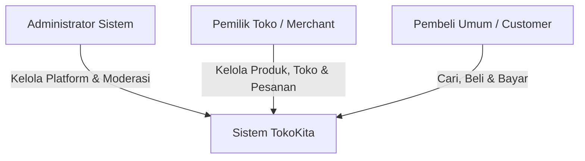
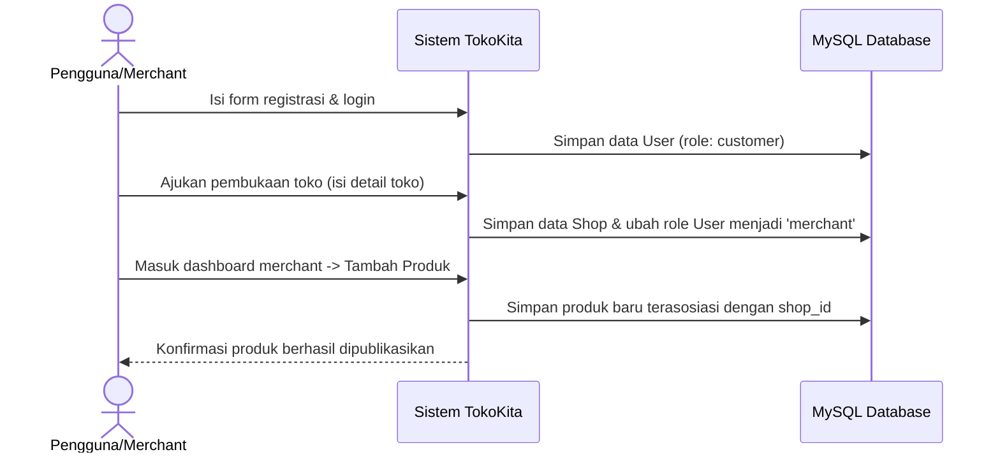
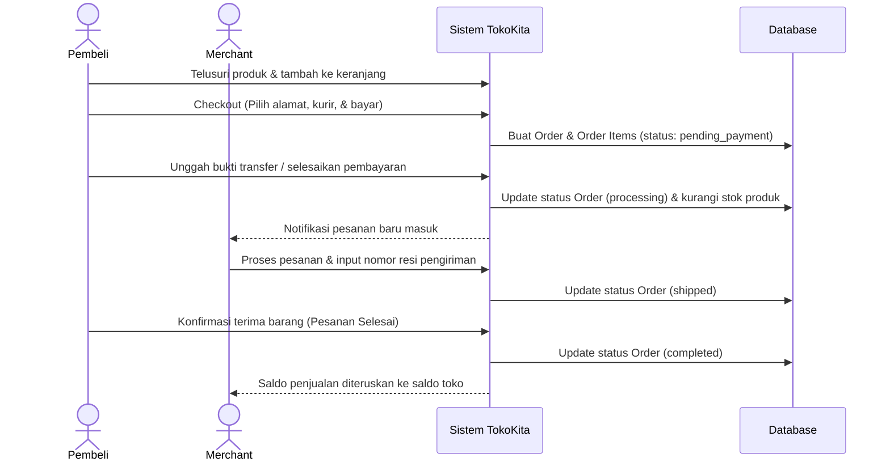

# Analisis Kebutuhan Sistem: TokoKita (Platform E-Commerce untuk UMKM)

Dokumen ini berisi analisis kebutuhan sistem yang mendalam untuk aplikasi **TokoKita**, sebuah platform e-commerce yang dirancang khusus untuk memfasilitasi Usaha Mikro, Kecil, dan Menengah (UMKM) dalam membuka toko online, mengelola operasional bisnis, serta memantau kinerja penjualan secara real-time.

---

## 1. Pendahuluan

### 1.1 Latar Belakang
UMKM memegang peranan krusial dalam perekonomian. Namun, banyak pemilik usaha kecil yang masih menghadapi kendala digitalisasi, seperti tingginya biaya pembuatan platform mandiri dan rumitnya pengelolaan inventaris serta transaksi secara manual. **TokoKita** hadir sebagai solusi platform multi-merchant yang memungkinkan pelaku UMKM membuat toko online mereka sendiri dengan mudah, mengelola produk, memproses pesanan, serta menerima pembayaran digital yang aman, sekaligus menyediakan fitur pelaporan analisis bisnis untuk membantu pengambilan keputusan.

### 1.2 Tujuan Sistem
- Memberikan wadah bagi pemilik UMKM untuk mendigitalisasi toko mereka secara instan.
- Mempermudah pembeli umum dalam menemukan dan membeli produk dari berbagai UMKM lokal.
- Menyediakan sistem manajemen inventaris, kategori, dan pesanan yang efisien untuk penjual.
- Menyediakan integrasi pembayaran yang aman bagi pembeli dan penjual.
- Menyajikan modul pelaporan performa toko (penjualan, stok, pendapatan) untuk membantu pemilik usaha memantau kinerja bisnis mereka.

### 1.3 Batasan Sistem & Teknologi
- **Kerangka Kerja Utama (Framework):** Laravel 10 (PHP 8.x)
- **Sistem Manajemen Basis Data:** MySQL
- **Model Bisnis:** Multi-tenant/Multi-merchant (satu platform, banyak toko mandiri)
- **Metode Pembayaran:** Simulasi Payment Gateway / Manual Transfer (dapat disesuaikan)
- **Arsitektur:** Model-View-Controller (MVC) standard Laravel atau API-based (opsional, disesuaikan kebutuhan praktikum/skripsi)

---

## 2. Pengguna Sistem (Actors)

Sistem TokoKita memiliki 3 peran utama (actors) dengan hak akses yang berbeda:

1. **Administrator Sistem (Admin Platform)**
   - Mengelola keseluruhan platform (pengguna, kategori global, konfigurasi sistem).
   - Memantau performa platform secara global.
   - Melakukan verifikasi dan moderasi terhadap toko baru atau produk yang melanggar ketentuan.

2. **Pemilik Toko (Merchant)**
   - Mendaftarkan toko dan mengatur profil toko (logo, deskripsi, alamat/lokasi pengiriman).
   - Mengelola katalog produk (tambah, ubah, hapus, kelola variasi & stok).
   - Memproses pesanan dari pembeli (konfirmasi, pengiriman, pembatalan).
   - Mengakses laporan penjualan, keuangan, dan analisis performa produk.

3. **Pembeli Umum (Customer)**
   - Menjelajahi produk dari berbagai toko, menggunakan fitur pencarian dan filter kategori.
   - Mengelola keranjang belanja (shopping cart).
   - Melakukan checkout pesanan dengan memilih kurir pengiriman dan metode pembayaran.
   - Melakukan konfirmasi pembayaran (jika manual) atau memantau status pesanan secara real-time.
   - Memberikan ulasan/feedback untuk produk yang telah dibeli.

---

## 3. Analisis Kebutuhan Fungsional (Functional Requirements)

Kebutuhan fungsional dikelompokkan berdasarkan modul utama sistem:

### 3.1 Modul Autentikasi dan Manajemen Pengguna
* **F-01: Registrasi Multi-Peran**  
  Pengguna dapat mendaftar sebagai Pembeli Umum. Pembeli yang terverifikasi dapat mengajukan pembukaan toko untuk menjadi Pemilik Toko.
* **F-02: Login & Logout**  
  Autentikasi aman menggunakan enkripsi password bawaan Laravel (bcrypt).
* **F-03: Manajemen Profil**  
  Pengguna dapat memperbarui informasi pribadi (nama, email, nomor telepon, foto profil, dan alamat pengiriman).

### 3.2 Modul Manajemen Toko (untuk Merchant)
* **F-04: Pengaturan Informasi Toko**  
  Pemilik Toko dapat mengatur nama toko, slug URL unik (e.g., `tokokita.com/toko/nama-toko`), deskripsi toko, foto sampul/logo, dan alamat toko untuk kalkulasi ongkos kirim.
* **F-05: Status Toko**  
  Pemilik Toko dapat membuka atau menutup tokonya sementara.

### 3.3 Modul Manajemen Produk (untuk Merchant)
* **F-06: Manajemen Katalog & Kategori**  
  Pemilik Toko dapat mengelompokkan produk berdasarkan kategori. Admin global mengelola kategori utama, sementara merchant dapat menambahkan kategori/tag internal toko.
* **F-07: CRUD Produk & Inventaris**  
  Operasi lengkap (Create, Read, Update, Delete) untuk produk, dilengkapi foto produk (multi-upload), deskripsi, harga, berat (dalam gram), dan jumlah stok minimum.
* **F-08: Pengurangan Stok Otomatis**  
  Sistem akan otomatis mengurangi jumlah stok produk saat pesanan berhasil dibuat (checkout/payment completed) dan mengembalikan stok jika pesanan dibatalkan (restock).

### 3.4 Modul Transaksi & Pembelian (untuk Pembeli)
* **F-09: Pencarian dan Filter Produk**  
  Pencarian produk berdasarkan nama, filter harga, kategori, lokasi toko, dan rating ulasan.
* **F-10: Keranjang Belanja (Shopping Cart)**  
  Menambahkan produk ke keranjang belanja, memperbarui jumlah kuantitas, menghapus item, dan menghitung total harga sementara.
* **F-11: Simulasi Ongkos Kirim**  
  Kalkulasi biaya pengiriman berdasarkan berat produk dan jarak/alamat pengirim (toko) ke alamat tujuan (pembeli).
* **F-12: Proses Checkout**  
  Mengunci pesanan, mencatat alamat pengiriman khusus, memilih opsi kurir, dan menghasilkan nomor invoice unik.

### 3.5 Modul Pembayaran & Integrasi
* **F-13: Pemilihan Metode Pembayaran**  
  Sistem mendukung opsi transfer bank manual atau simulasi virtual account/QRIS (bisa menggunakan simulasi callback Payment Gateway seperti Midtrans).
* **F-14: Konfirmasi Pembayaran**  
  Pembeli dapat mengunggah bukti transfer (jika menggunakan metode manual) atau sistem mendeteksi pembayaran secara otomatis (jika menggunakan simulasi API gateway).

### 3.6 Modul Pemrosesan Pesanan (Order Management)
* **F-15: Manajemen Alur Pesanan (Order Lifecycle)**  
  Perubahan status pesanan dikontrol secara ketat:
  `Menunggu Pembayaran` &rarr; `Menunggu Konfirmasi` &rarr; `Diproses` &rarr; `Dikirim` &rarr; `Selesai` / `Dibatalkan`.
* **F-16: Input Nomor Resi**  
  Merchant dapat menginput nomor resi pengiriman untuk melacak status paket oleh pembeli.

### 3.7 Modul Laporan dan Analisis Bisnis (untuk Merchant & Admin)
* **F-17: Dashboard Penjualan Terkini**  
  Visualisasi grafik penjualan harian, mingguan, dan bulanan menggunakan grafik (seperti Chart.js).
* **F-18: Laporan Keuangan & Pendapatan**  
  Laporan laba kotor, total transaksi sukses, rata-rata nilai pesanan, dan dana yang siap ditarik oleh merchant.
* **F-19: Laporan Stok & Inventaris**  
  Notifikasi atau daftar produk yang kehabisan stok (low-stock warning) agar merchant dapat segera melakukan restock.
* **F-20: Laporan Produk Terlaris (Best Selling Products)**  
  Analisis produk yang paling banyak terjual untuk membantu optimasi strategi promosi toko.
* **F-21: Laporan Aktivitas Pengguna (untuk Admin)**  
  Laporan pendaftaran user baru, pembukaan toko baru, dan total volume transaksi (GMV - Gross Merchandise Value) di seluruh platform.

---

## 4. Analisis Kebutuhan Non-Fungsional (Non-Functional Requirements)

| Parameter | Kebutuhan Non-Fungsional | Keterangan |
| :--- | :--- | :--- |
| **Keamanan (Security)** | - Hashing Password menggunakan Bcrypt. - Proteksi CSRF (Cross-Site Request Forgery) bawaan Laravel. - Pencegahan SQL Injection melalui Eloquent ORM. - Pembatasan otorisasi peran menggunakan Laravel Gate/Policy. | Mutlak diterapkan untuk melindungi data pengguna dan transaksi. |
| **Kinerja (Performance)** | - Response time halaman utama < 2 detik. - Optimasi query database menggunakan indexing pada foreign key (e.g., `user_id`, `shop_id`, `product_id`). - Paginasi (Pagination) pada daftar produk dan riwayat pesanan. | Menjaga kenyamanan pembeli saat menjelajahi platform. |
| **Ketersediaan & Keandalan (Reliability)** | - Mekanisme transaksi database (`DB::transaction`) untuk memastikan integritas data pesanan dan stok. - Penanganan error yang informatif (tidak menampilkan debug code Laravel ke pengguna umum). | Mencegah inkonsistensi stok saat terjadi lonjakan pesanan simultan. |
| **Kemudahan Penggunaan (Usability)** | - Tampilan antarmuka yang responsif (Mobile-friendly) menggunakan CSS Grid/Flexbox modern. - Navigasi yang intuitif dengan struktur menu terpisah untuk Pembeli dan Seller. | Memudahkan pelaku UMKM yang mungkin belum terbiasa dengan sistem digital rumit. |

---

## 5. Rancangan Awal Skema Basis Data (Database Schema Outline)

Untuk mendukung kebutuhan fungsional di atas, berikut adalah rancangan tabel database relasional di MySQL:

### 5.1 Entitas Pengguna & Toko
* **`users`**: Menyimpan data autentikasi pengguna platform.
  * `id` (PK), `name`, `email` (Unique), `password`, `phone`, `role` (enum: 'admin', 'merchant', 'customer'), `created_at`, `updated_at`.
* **`shops`**: Menyimpan profil toko milik merchant.
  * `id` (PK), `user_id` (FK to `users`), `name`, `slug` (Unique), `description`, `logo`, `banner`, `address`, `city_id`, `is_active` (boolean), `created_at`, `updated_at`.

### 5.2 Entitas Produk & Inventaris
* **`categories`**: Menyimpan kategori produk global.
  * `id` (PK), `name`, `slug` (Unique), `parent_id` (self-referencing FK), `created_at`, `updated_at`.
* **`products`**: Menyimpan detail produk yang dijual.
  * `id` (PK), `shop_id` (FK to `shops`), `category_id` (FK to `categories`), `name`, `slug`, `description`, `price`, `stock`, `weight` (gram), `image_url` (atau relasi tabel foto terpisah), `is_active` (boolean), `created_at`, `updated_at`.

### 5.3 Entitas Transaksi & Pembayaran
* **`orders`**: Menyimpan header transaksi pembelian.
  * `id` (PK), `invoice_number` (Unique), `customer_id` (FK to `users`), `shop_id` (FK to `shops`), `total_amount`, `shipping_cost`, `grand_total`, `status` (enum: 'pending_payment', 'processing', 'shipped', 'completed', 'cancelled'), `shipping_address`, `courier`, `tracking_number` (resi), `created_at`, `updated_at`.
* **`order_items`**: Menyimpan detail produk dalam satu pesanan (line-items).
  * `id` (PK), `order_id` (FK to `orders`), `product_id` (FK to `products`), `qty`, `price` (harga saat transaksi), `subtotal`, `created_at`, `updated_at`.
* **`payments`**: Menyimpan informasi pembayaran transaksi.
  * `id` (PK), `order_id` (FK to `orders`), `payment_method`, `payment_status` (enum: 'unpaid', 'paid', 'refunded'), `amount_paid`, `proof_of_payment` (bukti transfer file path), `paid_at`, `created_at`, `updated_at`.

### 5.4 Entitas Feedback & Review
* **`reviews`**: Ulasan produk dari pembeli setelah pesanan selesai.
  * `id` (PK), `order_item_id` (FK to `order_items`), `rating` (integer 1-5), `comment`, `created_at`, `updated_at`.

---

## 6. Alir Proses Bisnis Utama (Main Workflows)

### 6.1 Alur Registrasi, Buka Toko, & Tambah Produk

### 6.2 Alur Pemesanan & Siklus Pembayaran

---

## 7. Rencana Implementasi & Pengujian

### 7.1 Tahapan Pengembangan (Waterfall/Iterative)
1. **Analisis & Desain:** Desain database relasional, Use Case, dan Wireframing UI.
2. **Setup Basis Data & Model:** Migrasi Laravel (`migrations`) dan pembuatan relasi Eloquent (`hasMany`, `belongsTo`, dll).
3. **Pengembangan Backend & Bisnis Logik:** Manajemen produk, keranjang belanja, checkout, integrasi ongkir, dan status transaksi.
4. **Pembuatan Dashboard & Pelaporan:** Query agregasi SQL (`SUM`, `COUNT`, `GROUP BY`) untuk chart & laporan penjualan.
5. **Pengembangan Frontend:** Pembuatan antarmuka pengguna yang menarik, responsif, dan dinamis.
6. **Pengujian (Testing):** Unit testing, Integration testing untuk alur checkout-stok, dan User Acceptance Testing (UAT).

### 7.2 Rencana Pengujian Keandalan Laporan
Pengujian fitur laporan akan diverifikasi dengan membandingkan ringkasan data di dashboard dengan catatan transaksi manual di database untuk memastikan:
- Penjumlahan omzet (`grand_total`) benar dan tidak menggabungkan pesanan yang dibatalkan (`cancelled`).
- Pengurangan stok bekerja real-time dan mencegah *race condition* (pembelian melebihi stok yang ada).
- Data produk terlaris terurut secara akurat berdasarkan kuantitas penjualan tertinggi pada rentang waktu tertentu.
